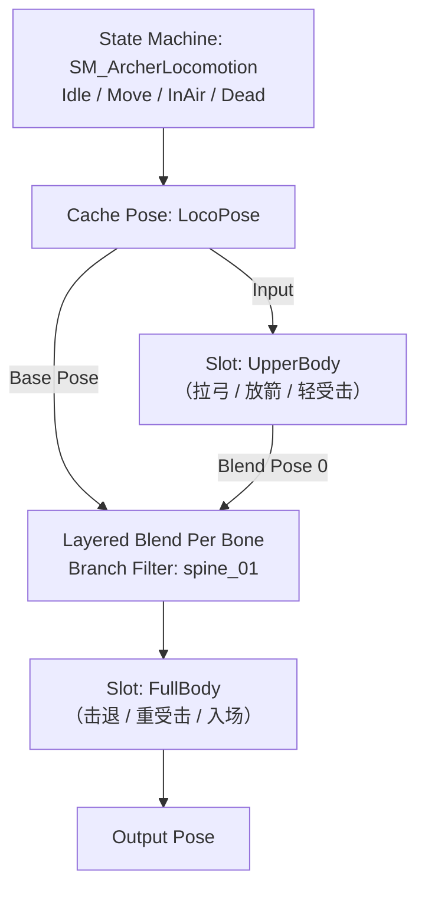

# 弓箭手小兵动画蓝图（AnimGraph）设计方案

适用对象：由技能召唤出来的弓箭手 AI 小兵，动画蓝图挂在其蓝图（如 `BP_Enemy_BowStance`）上。

---

## 0. 前提与约束

| 项 | 结论 |
|---|---|
| 角色定位 | 召唤类 AI 小兵，玩家不可操作 |
| 瞄准 | **不做** Aim Offset，不需要上半身俯仰/偏航补偿 |
| 攻击 | 完全由 GameplayAbility + AnimMontage 驱动 |
| 上下半身 | **必须分层**（下半身跑动 / 上半身拉弓放箭） |
| 移动射击 | 可能需要支持 |
| 动画素材 | 已有整套（含拉弓 / 放箭） |

由这四条约束推出三条设计原则：

1. **AnimGraph 只负责姿态混合，不负责决策。** "什么时候拉弓、什么时候放箭"由 GAS 层决定，所以所有一次性动作一律通过 **Slot + Montage** 注入，而不是在状态机里新增状态。
2. **性能优先级高于表现力。** 因为是刷怪器批量生成的小兵，同屏可能几十只，分层节点要用最轻的方案、取数走线程安全路径。
3. **没有瞄准 → locomotion 只需要一维。** 但"移动射击时朝哪边"这个前提还没定，它是唯一会影响素材采购的分叉点（见 §11）。

---

## 1. 总体拓扑



箭头方向 = 姿态求值流向。

四个关键结构决策：

**① 用 Cache Pose 把 locomotion 姿态复用两次。**
`Cache Pose` 的作用是让两个 Slot 都能拿到同一份 locomotion 姿态。**上半身 Slot 的 Input 一定要接**——如果空着不接，没播 montage 时该槽会落到参考姿势，上半身会散架。这是搭这个图最容易漏的一步。

**② 按"覆盖能力"从内到外排列，`FullBody` 放最外层。**
求值顺序是 `LBPB` 先算完整个角色，再由最外层的 `Slot: FullBody` 整体覆盖。

为什么不能把 `FullBody` 放在 `LBPB` 的 Base Pose 里（也就是分层之下）？因为 `Blend Pose 0` 的权重是 1.0，上半身**永远**由它决定——你播死亡动画，下半身倒了、上半身还在跑动，变成"只死下半身"。**全身动作槽必须在分层之后。**

**③ Slot 放在状态机*外面*，而不是嵌在状态机里面。**
这样任何 montage 都能在任意状态下播放，不需要为了"射击"新增状态和转换。对 GAS 驱动的小兵这是最省事、最不容易出错的结构——GA 随时可以 `PlayMontage`，AnimGraph 不用配合改。

**④ 分层用 Layered Blend Per Bone，不用"两套 Cache 再 Blend"。**
ALS 那套做法是为八向跑 + 大量叠加层设计的。这个需求只有一层上半身，用 LBPB 更轻、节点更少、对线程安全更友好。

后续如果同款骨架要复用给别的兵种（比如剑兵），可以把上半身单独抽成 **Anim Layer Interface**，让各兵种的 AnimBP 实现 `UpperBodyLayer`。当前单兵种不必要。

---

## 2. 骨架分层点

分界骨选 **`spine_01`**（UE5 Manny/Quinn 骨架里的腰椎第一节）。

- **上半身** = `spine_01` 及其所有子孙：`spine_02/03`、`neck_01`、`head`、`clavicle_l/r`、`upperarm_l/r`、`lowerarm_l/r`、`hand_l/r`，以及通过 Socket 挂在 `hand_r` 上的弓。
- **下半身** = `root`、`pelvis`、`thigh_l/r`、`calf_l/r`、`foot_l/r`、`ball_l/r`。

> **必须避开的坑：分支根不能设成 `pelvis`。**
> `pelvis` 属于下半身，它承担跑动时的骨盆起伏与侧倾。如果上半身层从 `pelvis` 开始覆盖，走路会变成"下半身纹丝不动、整个人飘着射箭"。

**可扩展点（当前不需要）：** 如果以后想让小兵"射箭时头看向目标"，可以在上半身层之上再加一层 `Layered Blend Per Bone (neck_01)`，权重绑一个 `HeadLookAtWeight` 变量。现在不需要，留个印象即可。

---

## 3. Layered Blend Per Bone 参数

| 参数 | 建议值 | 说明 |
|---|---|---|
| Branch Filters | 一条：`Bone Name = spine_01` | 见 §2 |
| **Blend Depth** | **先用 1** | ⚠️ **必须在编辑器里实测确认**，见下方 |
| Blend Weights | `[1.0]`，或绑 `UpperBodyBlendWeight` 变量 | 想做动态权重时再改成变量 |
| Mesh Space Rotation Blend | 先**不勾** | 勾上更抗上半身自转扭曲，但更贵。小兵优先性能；出现扭曲再勾 |
| Mesh Space Scale Blend | 不勾 | 没有缩放需求 |

### 关于 Blend Depth

这个参数的语义在社区里长期有争议，Epic 官方也没有给出清楚的权威解释（官方 Additive Animation 文档给的例子是 `spine_01` + Blend Depth = `1`，但论坛里普遍反映看不懂）。综合引擎实现和社区讨论，比较可信的语义是：

- `0` = **只有该骨本身**，不含子孙
- `-1` = **该骨及其以下全部子孙**
- 正数 N = 往下 N 层

如果这个语义成立，`spine_01` + Depth `1` 只能覆盖到脊柱附近，**手臂和头不会被驱动**——这正是"上半身层加了、但跑起来胳膊腿还在动"这类问题的常见来源。

所以建议这样处理：

1. **先把 `Blend Depth` 设成 `-1`**（一把覆盖 `spine_01` 的全部子孙）。
2. 在 `UpperBody` slot 里临时塞一个只动上半身的测试动画（或直接播 `AM_Archer_Shot` 的 Draw 段）。
3. 看现象定结论：
   - 双臂、头、手上的弓**都被驱动** → 对了。
   - 只有脊柱在动、手臂没跟上 → Depth 不够，手动往上加（2、3…）。
   - 连腿都在动 → Depth 太大，或者分支根选错了（确认是 `spine_01`，不是 `pelvis`）。

实测花 30 秒，比查文档快，也比照抄别人的数字靠谱。

---

## 4. Slot 命名与分工

用两个 Slot 节点，**名字必须和 AnimMontage 里 Slot 轨的名字逐字一致**（大小写敏感）。

| Slot 名 | 挂在拓扑的哪一层 | 承载什么 |
|---|---|---|
| `UpperBody` | LBPB 的 **Blend Pose 0** | 拉弓、放箭、轻受击（上半身抽搐） |
| `FullBody` | LBPB 的**外层**（最靠近 Output） | 击退、重受击、召唤入场 |

> **死亡不走 Slot**，而是走状态机的 `Dead` 状态（见 §5 与 §6 的说明）。理由是死亡是终态：montage 播完会自动 blend 回站姿，还得额外加锁去压住，不如状态机自洽。
>
> 如果你更希望死亡也由 GAS 以 montage 驱动（和攻击走完全相同的路径，代码更统一），那就把它放进最外层的 `FullBody` 槽——**但此时必须靠 `bIsDead` 把状态机锁在 Dead 状态**，否则 montage 一播完角色就站起来。两种做法都成立，别混用。

> ⚠️ 如果现有素材的蒙太奇用的是引擎默认的 `DefaultSlot`，要么把这些蒙太奇的 Slot 名改成上表的值，要么在图上额外加一个 `DefaultSlot` 节点。
> **绝对不要**让 `DefaultSlot` 和 `UpperBody` 接在同一层——那会把全身动作当上半身播。

Slot 节点在没播 montage 时是直通的，零额外开销。

---

## 5. Locomotion 状态机

小兵的 locomotion 要尽可能薄。四个状态：

```
SM_ArcherLocomotion
├── Idle     ← AS_Archer_Idle（呼吸待机）
├── Move     ← BS_Archer_Loco_1D（Speed 轴）
├── InAir    ← AS_Archer_Fall / Land        [可选]
└── Dead     ← AS_Archer_Death              [终态，无出口]
```

### 过渡表

| From | To | 条件 | Blend 时长 |
|---|---|---|---|
| Entry | Idle | — | — |
| Idle | Move | `Speed > 10` | 0.15 |
| Move | Idle | `Speed <= 10` | 0.25 |
| Any | InAir | `bIsFalling == true` | 0.10 |
| InAir | Idle | `!bIsFalling && Speed <= 10` | 0.15 |
| InAir | Move | `!bIsFalling && Speed > 10` | 0.15 |
| Any | Dead | `bIsDead == true` | 0.20 |

几个要点：

- **用 `Any State → Dead`，且 Dead 没有出口。** 这样死亡是真正的终态，既不依赖 montage 播完，也不需要额外加锁。UE 的 Any State 不会转换到"当前已经处于"的状态，所以 Dead 不会自己重入，写法是安全的。
- **阈值迟滞。** 单一阈值 10 在速度稳定后没问题，但小兵被导航推挤、互相卡位时速度会在 0 附近抖，造成 Idle/Move 反复横跳。如果实际出现抖动，把进入/退出阈值拉开（进 25 / 出 5），或者直接用 `bShouldMove = bIsAccelerating || Speed > 10`。
- **InAir 可以砍。** 如果召唤兵不会离地（不被击飞），删掉这个状态能省一整条转换链，状态机也更可读。先按"不一定需要"处理。

### BlendSpace 选型（关键分叉点）

- **默认（推荐）：BlendSpace1D，按 Speed。**
  Idle 单独做状态、不放进混合空间，空间里只放 Walk 和 Run：轴范围设成 `0 → MaxWalkSpeed`，采样点按素材的实际位移速度摆放。
- **同步组：** 在 BlendSpace Player 上设 Sync Group（如 `Loco`），让走/跑共享相位，避免变速时脚滑和抖动。
- **只有"边移动边面朝目标"才需要升级成 BlendSpace 2D**（Speed × Direction，即 strafe 素材）。因为已确定不做瞄准，默认不需要——但这条决定了素材要不要备八向，**建议先确认**（见 §11 第 1 条）。

### 关于 Root Motion

刷怪小兵通常由导航/代码驱动移动，**建议不要用 Root Motion**。有两个开关，位置别搞混：

- **动画资产上**：动画序列的 `Enable Root Motion`（`bEnableRootMotion`）——决定这条动画本身带不带根位移。
- **AnimBP 的 Class Defaults 上**：`Root Motion Mode`——建议设成 **`Ignore Root Motion`**；如果某些 montage 需要根位移（比如击退），用 `Root Motion from Montages Only`，这样只有 montage 里的根位移生效，locomotion 不受影响。

素材如果是 root motion 的而你又没处理，会出现"腿在跑、Actor 不动"的脚滑。

用 BlendSpace 时，保证采样点对应的"动画自身位移速度"和小兵实际的 Walk/Run 速度一致，才不搓脚。如果怎么都对不上，用一条 Anim Curve 驱动 Play Rate 做补偿。

---

## 6. 与 GAS 的接口契约

这是整套设计里最容易做歪的地方。原则一句话：**AnimGraph 不判断时机，只提供插槽。**

### 拉弓 / 放箭：一个 montage + 两个 section

```
AM_Archer_Shot          (Slot: UpperBody)
├── Section "Draw"      ← 拉弓到满弓，循环（把该 section 的循环打开，
│                          或把它的 Next Section 指向自己）
└── Section "Release"   ← 放箭 + 收势，播完自动 blend out
```

GA 侧：用 `PlayMontageAndWait` 从 `"Draw"` 段起手进入循环拉弓 → 蓄力条件满足后调 `MontageJumpToSection("Release")`。

好处：拉弓到放箭的衔接发生在 montage 内部，不会因为 crossfade 露出破绽；而且**蓄力时长可变**——这是"两个独立 montage"方案做不到的。

两个实操上的坑：

- **停在循环段上，任务永远不会完成。** `PlayMontageAndWait` 只在 montage 正常播放结束时广播 `OnCompleted`。循环拉弓时它一直不回来，所以蓄力阶段必须靠 `MontageJumpToSection("Release")` 走到收尾段，或者在被打断时显式结束技能。别写成"等这个任务完成再放箭"。
- **`PlayMontageAndWait` 有 Task Instance Name 入参。** 蓝图节点上留 `None` 让它自动取名即可；但如果同一次技能里要并发播多个 montage，得给每个任务起不同的名字，否则会互相顶掉。

快速原型阶段也可以用两个 montage（`AM_Archer_Draw` 循环 + `AM_Archer_Release` 单次），代价是衔接处要靠较短的 blend out 遮挡，容易露馅。正式版建议还是走 section 方案。

### 放箭时机

**不要在 AnimBP 里判断"该放箭了"。** 在 Release 段"箭离弦"的那一帧挂一个 AnimNotify，让 GA 收到后生成箭矢 Actor。这样动画和逻辑彻底解耦：改动画帧不用改代码，改代码不用动动画。

两种接法：

- **自己写一个 `UAnimNotify` 子类**（如 `AN_ArcherRelease`），在 `Notify()` 里直接触发生成箭矢。最直接、耦合最低，推荐。
- **发 GameplayEvent 给 ASC**：写一个 `UAnimNotify` 子类，`Notify()` 里用 `UAbilitySystemBlueprintLibrary::SendGameplayEventToActor` 发一个 Tag（如 `Event.Combat.Shoot`），GA 侧用 `WaitGameplayEvent` 接住。

> 第二种里"发 GameplayEvent 的 AnimNotify"**引擎和 GAS 插件都没有现成类**，得自己写。动手前先搜一下工程 `Source` 里有没有别人已经写过同类实现，别重复造。

蓄力窗口如果 GA 需要感知（比如"蓄满才有加成"），用 `AnimNotifyState` 标记起止。

### 受击 / 死亡

| 情况 | 走哪一层 | 备注 |
|---|---|---|
| 轻受击（上半身抖一下） | `UpperBody` slot | 不打断跑动 |
| 重受击 / 击退 | `FullBody` slot | 会盖掉 locomotion |
| 死亡 | 状态机 `Dead` 状态 | 不走 slot，避免 montage 播完 blend 回站姿 |

Blend 时间：上半身的 montage 建议 `BlendIn 0.15~0.25` / `BlendOut 0.2`。太长会让拉弓看起来"飘"，太短会突然抽搐。

---

## 7. AnimBP 取数：变量与线程安全

小兵同屏数量多，这一节直接决定帧率。

推荐做一个 C++ 动画实例 `UCC_EnemyAnimInstance : UAnimInstance`，在 `NativeThreadSafeUpdateAnimation()` 里算好，AnimBP 的父类选它。理由：线程安全、不用在图表里拉一长串 Property Access、在 C++ 里访问角色状态更自然。建议放在 `Source/GAS_Demo/Public/Character/Animation/`。

需要暴露的字段：

| 变量 | 类型 | 来源 | 说明 |
|---|---|---|---|
| `Speed` | float | `CharacterMovement->Velocity.Size2D()` | 状态机阈值 + BlendSpace 轴 |
| `bShouldMove` | bool | `bIsAccelerating \|\| Speed > 10` | 可选，比纯阈值稳 |
| `bIsFalling` | bool | `CharacterMovement->IsFalling()` | InAir 状态；不用就删 |
| `bIsDead` | bool | 见下 | Dead 状态 |
| `GroundDistance` | float | 向下射线 | 可选，贴地 / 落地 |
| `UpperBodyBlendWeight` | float | 常量 `1.0` | 留口子做动态权重 |

### 两个必须注意的点

**① 不要在线程安全的更新函数里读 ASC / GameplayAttribute。** 那不是线程安全的路径。正确做法是在 Character 侧把结果缓存成一个普通 `bool`（死亡时置 `bIsDead = true` 并广播），AnimBP 只读这个 bool。

**② `bIsDead` 在本工程目前还没有来源。** 据此前查阅工程源码的记录，`CC_AttributeSet::PostGameplayEffectExecute` 里**没有**实现 Health 相关处理，也就是说"血量 ≤ 0 → 死亡"这条链路是断的。要让 AnimGraph 的 Dead 状态真的能触发，得先在 AttributeSet 里补 Health 处理，再通知 Character 广播死亡，最后传到 AnimInstance。**这是 AnimGraph 之前的前置工作，别漏了**，否则 Dead 状态永远进不去。

> 这条是从之前会话的记录里带来的，动手前建议再翻一眼 `CC_AttributeSet.cpp` 确认一次；如果期间已经补上了就跳过这步。

如果用纯蓝图实现（不写 C++）：把计算放进 `BlueprintThreadSafeUpdateAnimation`，变量勾 **Thread Safe**；Locomotion 用 **Property Access** 拿 Speed（`GetPawn → GetMovementComponent → Velocity → VectorLengthXY`），完全不写 Tick。

---

## 8. 性能（刷怪器场景，重要）

`ACC_EnemySpawner` 会一次生成几十只小兵，动画会是首要瓶颈。按性价比排序：

1. **Update Rate Optimization (URO)** —— 骨骼网格组件上开 `bEnableUpdateRateOptimizations`，配置距离分档（近处每帧、远处 2~4 帧一次）。**一行改动，收益最大**，先做这个。
2. **Animation Budget Allocator** —— 引擎内置的动画预算系统，配合 Significance Manager 使用，专门为"同屏大量单位"设计。同屏数量再往上走就该开。
3. **LOD** —— 在骨骼网格的 LOD 设置里，远处关掉不需要的骨骼和曲线。
4. **别在 AnimBP 里做重活** —— 不做 `GetAllActorsOfClass`、不做每帧字符串查找、不做多余射线（`GroundDistance` 只有真需要才加）。
5. Leader Pose 共享骨骼求值虽然能省，但要求同款单位姿态完全一致——小兵各自状态、相位都不同，实用性有限，**不建议**为这点性能牺牲正确性。

---

## 9. 命名规范

对齐工程现有前缀习惯：

| 类型 | 命名 | 备注 |
|---|---|---|
| 动画蓝图 | `ABP_EnemyArcher` | 挂到 `BP_Enemy_BowStance`（或实际使用的弓兵蓝图） |
| 状态机 | `SM_ArcherLocomotion` | |
| 混合空间 | `BS_Archer_Loco_1D` | |
| 蒙太奇 | `AM_Archer_Shot` / `AM_Archer_HitLight` / `AM_Archer_Death` | |
| Slot | `UpperBody` / `FullBody` | |
| C++ 动画实例 | `UCC_EnemyAnimInstance` | `Source/GAS_Demo/Public/Character/Animation/` |
| AnimNotify | `AN_ArcherRelease` | Release 段放箭帧 |

---

## 10. 搭建顺序 checklist

1. 确认素材骨架与 `BP_Enemy_BowStance` 的骨骼网格一致（不一致要先做 IK Retargeter）。
2. 确认素材是不是 root motion，决定 `Root Motion Mode` 怎么设。
3. 建 `ABP_EnemyArcher`（父类先用 `UAnimInstance`，等 C++ 类写好再改父类）。
4. 建混合空间 `BS_Archer_Loco_1D`，设好采样点和 Sync Group。
5. 搭状态机 `SM_ArcherLocomotion`——**先只做 Idle/Move 两个状态跑通**，再加别的。
6. 状态机后面加一个 `Cache Pose`（命名 `LocoPose`），把 locomotion 姿态缓存下来复用。
7. 加 `Layered Blend Per Bone (spine_01)`：**Base Pose 接 `LocoPose`**；Blend Pose 0 接 `Slot: UpperBody`，并且 `Slot: UpperBody` 的 **Input 也要接 `LocoPose`**（千万别空着，见 §1 ①）。
8. 在 LBPB **之后**（更靠近 Output）加 `Slot: FullBody`，再接 Output Pose。
9. **实测 Blend Depth**：往 `UpperBody` slot 塞一个纯上半身动画，确认双臂/头/弓被驱动（见 §3）。
10. 建 `AM_Archer_Shot`，两个 section，Slot 名填 `UpperBody`。
11. 在 Release 段的放箭帧挂 AnimNotify。
12. GA 侧接 `PlayMontageAndWait` + `MontageJumpToSection`。
13. 补 `bIsDead` 的来源链（AttributeSet → Character → AnimInstance），再加 Dead 状态。
14. 开 URO，压测同屏 30 只。

---

## 11. 需要确认的点

1. **移动射击的朝向（唯一影响素材的点）**
   小兵是"停下来射"还是"边跑边射"？如果边跑边射，射的时候是**面朝移动方向**还是**面朝目标**？
   - 面朝移动方向 → 现在这套一维 BlendSpace 直接够用，上半身照常播 montage，**不用加东西**。
   - 面朝目标 → 需要 strafe 八向素材 + 2D BlendSpace，**素材可能要补**。
2. **素材现有 montage 的 Slot 名** —— 是不是 `DefaultSlot`？决定 §4 要不要改名。
3. **拉弓是 loop 还是单次** —— 决定 §6 走 section 方案还是双 montage 方案。
4. **小兵会不会离地** —— 决定要不要 InAir 状态。
5. **同屏上限** —— 决定 URO 和 Animation Budget Allocator 现在上还是以后上。

---

## 附：与其他部分的边界

- **动画蓝图不碰伤害。** 伤害走 `CC_LyraStyleDamage` → `GASDamageExecutionBase` → `CC_AttributeSet`，GameplayCue 用 `GameplayCue.Combat.HitImpact`。AnimGraph 只在收到"受击"事件后播对应的 montage，不参与伤害计算。
- **动画蓝图不管生成/销毁。** 生成由 `ACC_EnemySpawner` 负责，AnimBP 只管根据 `bIsDead` 切到 Dead 状态。
